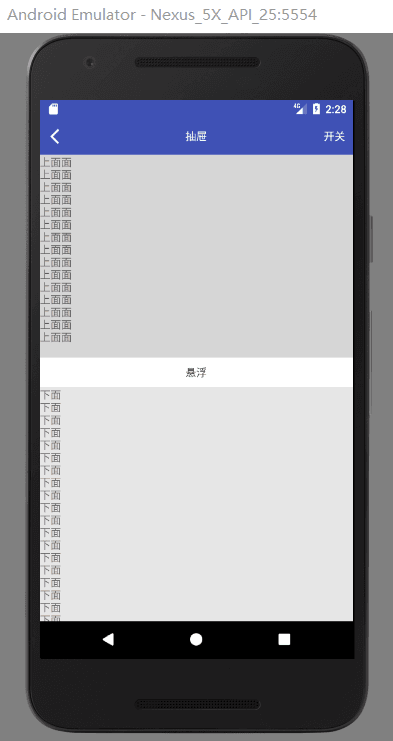

 微信公众号
 

[简书](https://www.jianshu.com/p/eb814d818c07)

[APK](https://github.com/AnJiaoDe/SlidingMenuVertical/blob/master/app/build/outputs/apk/app-debug.apk)


**使用方法**

将libray模块复制到项目中,或者直接在build.gradle中依赖:

```
allprojects {
		repositories {
			
			maven { url 'https://jitpack.io' }
		}
	}
```

```
dependencies {
	        compile 'com.github.AnJiaoDe:SlidingMenuVertical:V1.1.2'
	}
```

**注意：如果sync报错，是因为和com.android.tools.build:gradle 3.0有关，**
**可以改将compile改为implementation 或者api** 



[状态栏全透明请参考](https://github.com/AnJiaoDe/StatusNavigationTransparent)
 
 **注意：布局一定是SlidingMenuVertical包含2个直接子View**
```
<?xml version="1.0" encoding="utf-8"?>
<LinearLayout xmlns:android="http://schemas.android.com/apk/res/android"

    android:layout_width="match_parent"
    android:layout_height="match_parent"
    android:orientation="vertical">
    <com.cy.translucentparent.StatusBarView
        android:layout_width="match_parent"
        android:layout_height="wrap_content"
        android:background="#ff3F51B5"/>
    <RelativeLayout
        android:layout_width="match_parent"
        android:layout_height="48dp"
        android:background="#ff3F51B5">

        <ImageView
            android:layout_width="wrap_content"
            android:layout_height="match_parent"
            android:padding="10dp"
            android:scaleType="centerInside"
            android:src="@drawable/back" />

        <TextView
            android:layout_width="match_parent"
            android:layout_height="match_parent"
            android:gravity="center"
            android:text="抽屉"
            android:textColor="#ffffff" />

        <TextView
            android:id="@+id/tv_switch"
            android:layout_width="wrap_content"
            android:layout_height="match_parent"
            android:layout_alignParentRight="true"
            android:gravity="center"
            android:padding="10dp"
            android:text="开关"
            android:textColor="#ffffff" />
    </RelativeLayout>

    <com.cy.slidemenuvertical.SlidingMenuVertical
        android:id="@+id/slidingMenu"
        android:layout_width="match_parent"
        android:layout_height="match_parent">


        <TextView
            android:layout_width="match_parent"
            android:layout_height="wrap_content"
            android:background="#33454545"
            android:text="上面面\n上面面\n上面面\n上面面\n上面面\n上面面\n上面面\n上面面\n上面面\n上面面\n上面面\n上面面\n上面面\n上面面\n上面面\n" />


        <LinearLayout
            android:layout_width="match_parent"
            android:layout_height="match_parent"
            android:orientation="vertical">

            <TextView
                android:id="@+id/tv_middle"
                android:layout_width="match_parent"
                android:layout_height="wrap_content"
                android:gravity="center"
                android:paddingBottom="10dp"
                android:paddingTop="10dp"
                android:text="悬浮"
                android:textColor="#454545" />

            <ScrollView
                android:layout_width="match_parent"
                android:layout_height="match_parent"
                android:background="#e6e6e6"
                android:overScrollMode="never"
                android:scrollbars="vertical">

                <TextView
                    android:layout_width="match_parent"
                    android:layout_height="wrap_content"
                    android:text="下面\n下面\n下面\n下面\n下面\面\n下面\n下面\面\n下面\n下面\面\n下面\n下面\面\n下面\n下面\面\n下面\n下面\面\n下面\n下面\面\n下面\n下面\面\n下面\n下面\面\n下面\n下面\面\n下面\n下面\面\n下面\n下面\面\n下面\n下面\面\n下面\n下面\面\n下面\n下面\面\n下面\n下面\面\n下面\n下面\面\n下面\n下面\面\n下面\n下面\面\n下面\n下面\面\n下面\n下面\面\n下面\n下面\面\n下面\n下面\面\n下面\n下面\面\n下面\n下面\面\n下面\n下面\面\n下面\n下面\面\n下面\n下面\面\n下面\n下面\面\n下面\n下面\面\n下面\n下面\面\n下面\n下面\面\n下面\n下面\面\n下面\n下面\面\n下面\n下面\面\n下面\n下面\面\n下面\n下面\面\n下面\n下面\面\n下面\n下面\面\n下面\n下面\面\n下面\n下面\面\n下面\n下面\面\n下面\n下面\面\n下面\n下面\面\n下面\n下面\面\n下面\n下面\面\n下面\n下面\n下面\n下面\n下面\n下面\n下面\n下面\n下面\n下面\n下面\n下面\n下面\n下面\n下面\n下面\n下面\n下面\n下面\n下面\n下面\n下面\n下面\n下面\n下面\n下面\n下面\n下面\n下面\n下面\n下面\n下面\n下面\n下面\n下面\n下面\n下面\n下面\n下面\n下面\n下面\n下面\n下面\n下面\n下面\n下面\n下面\n下面\n下面\n下面\n下面\n下面\n下面\n下面\n下面\n下面\n下面\n下面\n下面\n下面\n下面\n下面\n下面\n菜逼" />
            </ScrollView>
        </LinearLayout>


    </com.cy.slidemenuvertical.SlidingMenuVertical>
</LinearLayout>

```

```
public abstract class BaseActivity extends AppCompatActivity implements View.OnClickListener {

    @Override
    protected void onCreate(@Nullable Bundle savedInstanceState) {
        super.onCreate(savedInstanceState);

        StatusNavUtils.setStatusBarColor(this,0x00000000);
    }
    public void startAppcompatActivity(Class<?> cls) {
        startActivity(new Intent(this, cls));
    }


}

```

```
public class MainActivity extends BaseActivity {

    @Override
    protected void onCreate(Bundle savedInstanceState) {
        super.onCreate(savedInstanceState);
        setContentView(R.layout.activity_main);

        final TextView tv_middle = (TextView) findViewById(R.id.tv_middle);
        final SlidingMenuVertical slidingMenuVertical = ((SlidingMenuVertical) findViewById(R.id.slidingMenu));
         slidingMenuVertical.setDuration_max(300);//设置 设置松手后 开闭最长过渡时间
        slidingMenuVertical.setAmbit_scroll(100);//修改滑动界限 值，值越大  开闭越难  单位ms
        slidingMenuVertical.setOnSwitchListener(new SlidingMenuVertical.OnSwitchListener() {
            /*
                   滑动中
        y_now:实时view_bottom的top y, y_opened:抽屉打开时view_bootom的top y,y_closed:抽屉关闭时view_bottom的top y  top y:在屏幕中的top y坐标

                    */
            @Override
            public void onSwitching(boolean isToOpen, int y_now, int y_opened, int y_closed) {

                tv_middle.setBackgroundColor(Color.argb((int) (1.0f * (y_opened - y_now) / (y_opened - y_closed) * 255),
                        Color.red(0xff3F51B5), Color.green(0xff3F51B5), Color.blue(0xff3F51B5)));

                tv_middle.setTextColor(Color.argb((int) (1.0f * (y_opened - y_now) / (y_opened - y_closed) * 255),
                        Color.red(0xffffffff), Color.green(0xffffffff), Color.blue(0xffffffff)));
            }

            @Override
            public void onSwitched(boolean opened) {

                if (opened) {
                    tv_middle.setBackgroundColor(0xffffffff);
                    tv_middle.setTextColor(0xff454545);
                }
            }
        });

        findViewById(R.id.tv_switch).setOnClickListener(new View.OnClickListener() {
            @Override
            public void onClick(View v) {
                slidingMenuVertical.open(!slidingMenuVertical.isOpened());
            }
        });
    }

    @Override
    public void onClick(View v) {

    }
}

```

 **源码**

**SlidingMenuVertical**

```
public class SlidingMenuVertical extends LinearLayout {
    private Scroller mScroller;
    private View view_top;
    private View view_bottom;
    private float downX;
    private float downY;
    private boolean opened = true;//状态是否开闭


    private OnSwitchListener onSwitchListener;


    private int duration_max = 300;//最长过度时间

    private int ambit_scroll = 100;//滑动界限，开闭

    private int y_opened = -1;    // * y_opened:抽屉打开时view_bootom的top y

    public SlidingMenuVertical(Context context) {
        this(context, null);
    }


    public SlidingMenuVertical(Context context, AttributeSet attrs) {
        super(context, attrs);
        mScroller = new Scroller(context);
        setOrientation(VERTICAL);
    }

    @Override
    protected void onFinishInflate() {
        // 当xml解析完成时的回调

        view_top = getChildAt(0);
        view_bottom = getChildAt(1);


    }

    @Override
    protected void onMeasure(int widthMeasureSpec, int heightMeasureSpec) {
        super.onMeasure(widthMeasureSpec, heightMeasureSpec);


        view_top.measure(widthMeasureSpec, ViewMeasureUtils.getChildHeightMeasureSpec(view_top, heightMeasureSpec));

//        view_middle.measure(widthMeasureSpec,ViewMeasureUtils.getChildHeightMeasureSpec(view_middle,heightMeasureSpec));
        view_bottom.measure(widthMeasureSpec, heightMeasureSpec);

    }


    @Override
    public boolean onInterceptTouchEvent(MotionEvent event) {

        setY_opened();
        // 拦截
        // 竖直滑动时，去拦截
        switch (event.getAction()) {
            case MotionEvent.ACTION_DOWN:
                downX = event.getX();
                downY = event.getY();

                break;
            case MotionEvent.ACTION_MOVE:
                float moveX = event.getX();
                float moveY = event.getY();
                // 竖直滑动

                if (Math.abs(moveY - downY) > Math.abs(moveX - downX)) {
                    //上面隐藏
                    if (opened == false) {

                        return false;
                    }

                    //上面显示并且下滑
                    if (opened == true && (moveY - downY) > 0) {

                        return false;
                    }

                    return true;
                }
                break;
            case MotionEvent.ACTION_UP:
                break;
            default:
                break;
        }
        return super.onInterceptTouchEvent(event);
    }

    @Override
    public boolean onTouchEvent(MotionEvent event) {
        switch (event.getAction()) {
            case MotionEvent.ACTION_DOWN:
                downX = event.getX();
                downY = event.getY();
                break;
            case MotionEvent.ACTION_MOVE:
                float moveX = event.getX();
                float moveY = event.getY();

                int dy = (int) (downY - moveY + 0.5f);// 四舍五入 20.9 + 0.5-->20


//                Log.e("dy","++++++++++++++++++++++++++++"+dy);

                int scrollY = getScrollY();
                //mDownY - moveY>0上滑

                if (scrollY + dy > 0) {
                    scrollBy(0, dy);
                    if (scrollY + dy > getHeight_top()) {
                        scrollTo(0, getHeight_top());
                    }
                }

                downX = moveX;
                downY = moveY;

                break;
            case MotionEvent.ACTION_UP:
//                Log.e("heigth_top", "+++++++++++++++++" + height_top);
//                Log.e("scrollY", "+++++++++++++++++" + getScrollY());
                if (opened) {


                    open(!(getScrollY() > ambit_scroll || getScrollY() > getHeight_top() / 3));

                } else {

                    open(getScrollY() < getHeight_top() - ambit_scroll || getScrollY() < getHeight_top() * 2 / 3);

                }

                break;

        }
        // 消费掉
        return true;
    }

    /**
     * 开闭抽屉
     *
     * @param open
     */
    public void open(boolean open) {
        setY_opened();

        this.opened = open;
        //打开
        if (open) {

//            Log.e("打开", "+++++++++++++++++++++++++++++");


            int startX = getScrollX();// 起始的坐标X
            int startY = getScrollY();// 起始的坐标Y

            int endX = 0;
            int endY = 0;

            int dx = endX - startX;// 增量X
            int dy = endY - startY;// 增量Y
            // 1px = 10
            int duration = Math.abs(dy) * 10;
            if (duration > duration_max) {
                duration = duration_max;
            }

            mScroller.startScroll(startX, startY, dx, dy, duration);
        } else {


            Log.e("关闭", "+++++++++++++++++++++++++++++" + getScrollY());
            int startX = getScrollX();// 起始的坐标X
            int startY = getScrollY();// 起始的坐标Y

            int endX = 0;
            int endY = getHeight_top();

            int dx = endX - startX;// 增量X
            int dy = endY - startY;// 增量Y

            // 1px = 10
            int duration = Math.abs(dy) * 10;
            if (duration > duration_max) {
                duration = duration_max;
            }

            // 模拟数据变化
            mScroller.startScroll(startX, startY, dx, dy, duration);
        }

        invalidate();// 触发ui绘制 --> draw() --> dispatchDraw()--> drawChild -->
    }

    @Override
    public void computeScroll() {
        if (mScroller.computeScrollOffset()) {// 如果正在计算的过程中
            // 更新滚动的位置
            scrollTo(0, mScroller.getCurrY());
            invalidate();
        }

    }

    @Override
    protected void onScrollChanged(int l, int t, int oldl, int oldt) {
        super.onScrollChanged(l, t, oldl, oldt);

//        Log.e("y_now", ScreenUtils.getViewScreenLocation(view_bottom)[1] + "++++++++++++++++++++++");
//
//        Log.e("y_closed", y_opened - height_top + "++++++++++++++++++++++");

        if (onSwitchListener != null) {
            onSwitchListener.onSwitching(t - oldt < 0 ? true : false,
                    getY_now(), getY_opened(), getY_opened() - getHeight_top());
            if (getY_now() == getY_opened()) {
//                Log.e("true", "++++++++++++++++++++++++");
                onSwitchListener.onSwitched(true);
            }
            if (getY_now() == getY_opened() - getHeight_top()) {
//                Log.e("false", "++++++++++++++++++++++++");

                onSwitchListener.onSwitched(false);
            }

        }
    }

    public boolean isOpened() {
        return opened;
    }

    public int getDuration_max() {
        return duration_max;
    }

    /**
     * 设置松手后 开闭最长过渡时间
     *
     * @param duration_max
     */
    public void setDuration_max(int duration_max) {
        this.duration_max = duration_max;
    }

    public View getView_top() {
        return view_top;
    }

    public View getView_bottom() {
        return view_bottom;
    }

    public int getHeight_top() {
        return view_top.getMeasuredHeight();
    }

    /**
     * 获取 * y_opened:抽屉打开时view_bootom的top y
     */
    private void setY_opened(){

        if (y_opened<0){

            y_opened=getViewScreenLocation(view_bottom)[1];
            Log.e("y _open",y_opened+"++++++++++++++++++++");
        }
    }
    /**
     * y_opened:抽屉打开时view_bootom的top y
     *
     * @return
     */
    public int getY_opened() {
        if (y_opened<0){
            Log.e("还未计算出来","+++++++++++++++++++++++++++++++++++");
            return 0;
        }
        return y_opened;
    }

    /**
     * y_now:抽屉实时view_bootom的top y
     *
     * @return
     */
    public int getY_now() {
        return getViewScreenLocation(view_bottom)[1];
    }

    public int getAmbit_scroll() {
        return ambit_scroll;
    }

    /**
     * 修改滑动界限 值，值越大  开闭越难  单位ms
     *
     * @param ambit_scroll <height_top
     */

    public void setAmbit_scroll(int ambit_scroll) {
        this.ambit_scroll = ambit_scroll;
    }

    /**
     * 计算指定的 View 在屏幕中的坐标。
     */
    public  int[] getViewScreenLocation(View view) {
        int[] location = new int[2];
        // 获取控件在屏幕中的位置，返回的数组分别为控件左顶点的 x、y 的值
        view.getLocationOnScreen(location);

        return location;
    }
    public interface OnSwitchListener {

        /*
        滑动中
        y_now:实时view_bottom的top y, y_opened:抽屉打开时view_bootom的top y,y_closed:抽屉关闭时view_bottom的top y  top y:在屏幕中的top y坐标

         */
        public void onSwitching(boolean isToOpen, int y_now, int y_opened, int y_closed);

        /*
        滑动停止，状态是否开闭
         */
        public void onSwitched(boolean opened);
    }

    public void setOnSwitchListener(OnSwitchListener onSwitchListener) {
        this.onSwitchListener = onSwitchListener;
    }
}
```
**ViewMeasureUtils**
```
public class ViewMeasureUtils {

    /**
     * 根据父 View 规则和子 View 的 LayoutParams，计算子类的宽度(width)测量规则
     *
     * @param view
     */
    public static int getChildWidthMeasureSpec(View view, int parentWidthMeasureSpec) {
        // 获取父 View 的测量模式
        int parentWidthMode = MeasureSpec.getMode(parentWidthMeasureSpec);
        // 获取父 View 的测量尺寸
        int parentWidthSize = MeasureSpec.getSize(parentWidthMeasureSpec);

        // 定义子 View 的测量规则
        int childWidthMeasureSpec = 0;

        // 获取子 View 的 LayoutParams
        ViewGroup.LayoutParams layoutParams = (ViewGroup.LayoutParams) view.getLayoutParams();


        if (parentWidthMode == MeasureSpec.EXACTLY || parentWidthMode == MeasureSpec.AT_MOST) {
        /* 这是当父类的模式是 dp 的情况 */
            if (layoutParams.width > 0) {
                childWidthMeasureSpec = MeasureSpec.makeMeasureSpec(layoutParams.width, MeasureSpec.EXACTLY);
            } else if (layoutParams.width == ViewGroup.LayoutParams.WRAP_CONTENT) {
                childWidthMeasureSpec = MeasureSpec.makeMeasureSpec(parentWidthSize, MeasureSpec.AT_MOST);
            } else if (layoutParams.width == ViewGroup.LayoutParams.MATCH_PARENT) {
                childWidthMeasureSpec = MeasureSpec.makeMeasureSpec(parentWidthSize, MeasureSpec.EXACTLY);
            }
        } else if (parentWidthMode == MeasureSpec.UNSPECIFIED) {
        /* 这是当父类的模式是 MATCH_PARENT 的情况 */
            if (layoutParams.width > 0) {
                childWidthMeasureSpec = MeasureSpec.makeMeasureSpec(layoutParams.width, MeasureSpec.EXACTLY);
            } else if (layoutParams.width == ViewGroup.LayoutParams.WRAP_CONTENT) {
                childWidthMeasureSpec = MeasureSpec.makeMeasureSpec(0, MeasureSpec.UNSPECIFIED);
            } else if (layoutParams.width == ViewGroup.LayoutParams.MATCH_PARENT) {
                childWidthMeasureSpec = MeasureSpec.makeMeasureSpec(0, MeasureSpec.UNSPECIFIED);
            }
        }

        // 返回子 View 的测量规则
        return childWidthMeasureSpec;
    }

    /**
     * 根据父 View 规则和子 View 的 LayoutParams，计算子类的宽度(width)测量规则
     *
     * @param view
     */
    public static int getChildHeightMeasureSpec(View view, int parentHeightMeasureSpec) {
        // 获取父 View 的测量模式
        int parentHeightMode = MeasureSpec.getMode(parentHeightMeasureSpec);
        // 获取父 View 的测量尺寸
        int parentHeightSize = MeasureSpec.getSize(parentHeightMeasureSpec);

        // 定义子 View 的测量规则
        int childHeightMeasureSpec = 0;

        // 获取子 View 的 LayoutParams
        ViewGroup.LayoutParams layoutParams = (ViewGroup.LayoutParams) view.getLayoutParams();


        if (parentHeightMode == MeasureSpec.EXACTLY || parentHeightMode == MeasureSpec.AT_MOST) {
        /* 这是当父类的模式是 dp 的情况 */
            if (layoutParams.height > 0) {
                childHeightMeasureSpec = MeasureSpec.makeMeasureSpec(layoutParams.height, MeasureSpec.EXACTLY);
            } else if (layoutParams.height == ViewGroup.LayoutParams.WRAP_CONTENT) {
                childHeightMeasureSpec = MeasureSpec.makeMeasureSpec(parentHeightSize, MeasureSpec.AT_MOST);
            } else if (layoutParams.width == ViewGroup.LayoutParams.MATCH_PARENT) {
                childHeightMeasureSpec = MeasureSpec.makeMeasureSpec(parentHeightSize, MeasureSpec.EXACTLY);
            }
        } else if (parentHeightMode == MeasureSpec.UNSPECIFIED) {
        /* 这是当父类的模式是 MATCH_PARENT 的情况 */
            if (layoutParams.height > 0) {
                childHeightMeasureSpec = MeasureSpec.makeMeasureSpec(layoutParams.height, MeasureSpec.EXACTLY);
            } else if (layoutParams.height == ViewGroup.LayoutParams.WRAP_CONTENT) {
                childHeightMeasureSpec = MeasureSpec.makeMeasureSpec(0, MeasureSpec.UNSPECIFIED);
            } else if (layoutParams.height == ViewGroup.LayoutParams.MATCH_PARENT) {
                childHeightMeasureSpec = MeasureSpec.makeMeasureSpec(0, MeasureSpec.UNSPECIFIED);
            }
        }

        // 返回子 View 的测量规则
        return childHeightMeasureSpec;
    }
}

```


 
 
 **更新日志**
 
 *V1.1.1*
  - Android 自定义控件之SlidingMenuVertical顶部悬浮(垂直折叠抽屉，有滑动渐变回调，可自行添加渐变动画)
  
  

**License**

 Copyright [AnJiaoDe] [name of copyright owner]

   Licensed under the Apache License, Version 2.0 (the "License");
   you may not use this file except in compliance with the License.
   You may obtain a copy of the License at

       http://www.apache.org/licenses/LICENSE-2.0

   Unless required by applicable law or agreed to in writing, software
   distributed under the License is distributed on an "AS IS" BASIS,
   WITHOUT WARRANTIES OR CONDITIONS OF ANY KIND, either express or implied.
   See the License for the specific language governing permissions and
   limitations under the License.

 
 
[GitHub](https://github.com/AnJiaoDe)

关注专题[Android开发常用开源库](https://www.jianshu.com/c/3ff4b3951dc5)

[简书](https://www.jianshu.com/u/b8159d455c69)

 微信公众号
 

QQ群


 
 

 
